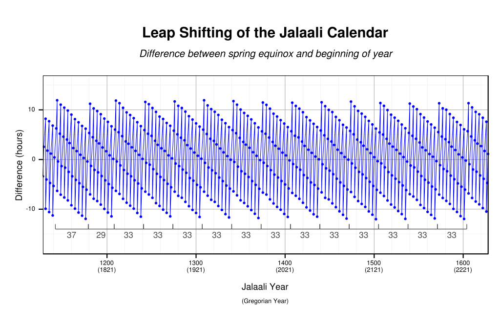

 Persian(Jalali) calendar converter
===
Goals:
---
0. **Representing Persian(Jalai) calendar as similar as possible to what [ISO 8601](https://en.wikipedia.org/wiki/ISO_8601)  introduced for Gregorian calendar**
1. **Persian(Jalai) data/datetime struct/class**
2. **Generating Persian(Jalai) date/datetime by numbers**
3. **Converting Persian(Jalali) date to [JDN](https://en.wikipedia.org/wiki/Julian_day)(Julian day)  and reverse**
4. **Converting Persian(Jalai) calendar datetime to unix epoch and reverse**
5. **Converting Persian(Jalai) calendar date to [Gregorian calendar ](https://en.wikipedia.org/wiki/Gregorian_calendar) and [Proleptic Gregorian calendar](https://en.wikipedia.org/wiki/Proleptic_Gregorian_calendar)  for dates older than 1582(When Gregorian calendar introduced) and reverse**
6. **Converting Persian(Jalai) calendar date to [Julian(old) calendar](https://en.wikipedia.org/wiki/Julian_calendar)  and [Proleptic Julian calendar](https://en.wikipedia.org/wiki/Proleptic_Julian_calendar)  (Before [AD 8](https://en.wikipedia.org/wiki/AD_8)  ) and reverse**
7. **Formating Persian(Jalai) date to text (English/Persian)**
8. **Parsing Persian(Jalai) date from text (English/Persian)** 
***

Decision about year 0:
---
There is an argue about year 0 in calendars. By definition of historians there is not any year 0 (zero) in calendar and just befor year 1 there was year -1 (In Gregorian or Julian BC or BCE for years before 1 and AD or CE for year 1 and beyond) but by definition of astronomers they count year 0 and so in astronomical calendar there is year 0 before year 1.
Here I decided to follow astronomical way and count year 0 (It makes calculation easier) although it may need extra attention to historical events before year 1.

Base knowledge:
---
- **Persian(Jalai) Calendar:**
>"The Solar Hijri calendar (Persian: گاه‌شماری هجری خورشیدی‎, romanized: gāhshomāri-ye hejri-ye khorshidi; Pashto: لمريز لېږدیز کلیز‎), also called the Iranian Hijri calendar or Shamsi Hijri calendar, and abbreviated as SH, is the official calendar of Iran and Afghanistan. It begins on the March equinox (Nowruz) as determined by astronomical calculation for the Iran Standard Time meridian (52.5°E, UTC+03:30) and has years of 365 or 366 days." [Wikipedia/Solar_Hijri_Calendar](https://en.wikipedia.org/wiki/Solar_Hijri_calendar#Accuracy) 

As we see by definition in wikipedia the Jalali calendar based on real event of vernal equinox and we know this moment changes every year due to astronomical corelation between earth and sun and moon. 
It is observed and calculated for thousands of years so far and we know the length of a mean solar year betweem two following vernal equionx evnet is something about 365 days, 5 hours, 48 minutes and 45 seconds (365.24219 days) as average for about 2000 years. It can varies less than an hour during years.
As the length of solar year (let's call it [Tropical Year](https://en.wikipedia.org/wiki/Tropical_year) ) is not a round number of days we count years by common year (365 days) or leap year (366 days) to reflect this difference(like all other solar calendars, [Gregorian calendar](https://en.wikipedia.org/wiki/Gregorian_calendar) , [Julian calendar](https://en.wikipedia.org/wiki/Julian_calendar))
We indicate a Persian(Jalali) date by SH postfix to distinguish with Gregorian 

- **Persian(Jalai) Calendar Leap year calculation:**
To calculate Nowruz (First day of year) we attend to vernal equinox moment in the day it happen. So if it happen before exact noon time (Sun transit time) we accept the day as the first day of new year and if it happen after exact noon time (Sun transit)  we call it the last day of ending year. So then we can find if the last month of ending year is 29 or 30 days and so is the ending year a common or leap year.
As this decision is dependent to time zone of calculation and as this is basically an Iranian (Persian) calendar it accepted to use Iran Satandard Time zone (IRST) (UTC)as its base of calculation.
Since the calendar uses astronomical calculation for determining the vernal equinox, it has no intrinsic error, but this makes it an observation-based calendar.
>

Although precise year calculation by this definition needs observation, there are efforts to define its mathematical algorithm.

**0-** First of all what we believe calculated by Iranian historical scientist [**Omar Khayyam**](https://en.wikipedia.org/wiki/Omar_Khayyam)  (Mathematician-Astronomist-Poet and Philosopher) (18 May 1048 – 4 December 1131) and his team and successor [**Al-Khazini**](https://en.wikipedia.org/wiki/Al-Khazini)  . They amazingly calculated tropical mean year length as 365.2424 days that is even more accurate than mean Gregorain year length 365.2425 calculated about 500 years later!!!
So by this caculation they suggested a 33 years cycle for leap year calculation with 25 common year and 8 leap year.

**1-** One of the most famous is [**Zabih Behruz**](https://en.wikipedia.org/wiki/Zabih_Behrouz) -  [**Ahmad Birashk**](https://en.wikipedia.org/wiki/Solar_Hijri_calendar#Birashk_leap_year_algorithm) leap year algorithm. 
Iranian mathematician Ahmad Birashk (1907-2002) proposed an alternative means of determining leap years. Birashk's book came out in 1993, and his algorithm was based on the same apparently erroneous presumptions as used by Zabih Behruz in his book from 1952. Birashk's technique avoids the need to determine the moment of the astronomical equinox, replacing it with a very complex leap year structure. Years are grouped into cycles which begin with four normal years followed by a leap year and after which every fourth subsequent year in the cycle is a leap year. Cycles are grouped into grand cycles of either 128 years (composed of cycles of 29, 33, 33, and 33 years) or 132 years, containing cycles of 29, 33, 33, and 37 years. A great period cycle is composed of 21 consecutive 128-year grand cycles and a final 132 grand cycle, for a total of 2820 years. By this suggestion a grand period started from -2345SH(by counting year 0) or -2346SH without a year zero in mind. So this grand period has ended on 474 SH and next grand period started from 476 SH.
There are argues about this [calculation accuracy](https://en.wikipedia.org/wiki/Solar_Hijri_calendar#Accuracy_of_the_Birashk_algorithm) .A detailed argue in this subject introduced by [**M. Heydari-Malayeri**](http://aramis.obspm.fr/~heydari/divers/ir-cal-eng.pdf) and other article by [**ماشاءالله على احیایى**](https://jihs.ut.ac.ir/article_11493_cab7c31e3bbdab0b906887b4457010a9.pdf) 

**2-** Another method suggested by [**Musa Akrami**](https://jihs.ut.ac.ir/article_36132_d63382c3dffb2b260b27f221afc10077.pdf) . In his calculation he accepted the mean tropical year length as 365.24219879 days. He used the fraction of day 0.24219879 days (= 5 hours + 48 minutes + 45.975456 seconds) for reference and assumed if calculated vernal equinox happens between noon and a "day fraction" before noon (12 hours – “day fraction”≈ 6 hours + 11 minutes + 14.024544 seconds = 6:11:14.024544  and 12:00:00) this should be a leap year ending and in other cases it is a common year ending.

**3-** [**Rezazadeh-malek**](https://fa.wikipedia.org/wiki/%D8%B1%D8%AD%DB%8C%D9%85_%D8%B1%D8%B6%D8%A7%D8%B2%D8%A7%D8%AF%D9%87_%D9%85%D9%84%DA%A9) suggested 128 years cycles (composed of cycles of 29, 33, 33, and 33 years). He introduced year -70SH(including year 0) or -71SH(excluding year 0) for the begining of first 128 years cycle.

**4-** [**Reza Abdollahi**](http://etheses.dur.ac.uk/1854/) suggested same 128 years cycles but introduced year -37SH(including year 0) or year -38SH(excluding year 0) as the beginning of cycles.

**5-** Ali-mohammad Kaveh(1920-1996) suggested 161 years cycles (composed of 33,33,33,33 and 29 years cycles). He introduced year -140SH(including year 0) or year -141SH(excluding year 0) as the first year of ninth cycle.

**6-** The next method suggested by [**MohammadReza Sayad**](http://mirasmaktoob.ir/fa/system/files/nashriat/ME3-Sayad-Sal.pdf) suggested to use vernal equinox moments calculated by a software named [**"Accurate Times" by Mohammad Odeh** ](http://www.icoproject.org/accut.html?l=en) . This software originaly programed to calculate lunar events and Islamic calender for religiose porposes in Islamic countries and adopted by the Jordanian Ministry of Islamic Affairs to calculate the prayer times in Jordan and afterward accepted as official software to calculate prayer times in UAE. So it seems reasonably precise. By this software he suggested a large complex combination of different cycles(227, 260, 128, 99, 161, 260, 227, 260, 425, 99, 293, 132, 425, 132, 132, 132 and 528 years). His calculation starts from year -940SH(including year 0) and ends by 2979SH.

___

We need to compare these methods and also we need some references to evaluate their accuracy. For this evaluation I used these sources:
a) New year moments from 1360 SH(Persian calendar) to 1399 SH by [Calendar Center in University of Tehran](https://calendar.ut.ac.ir/Fa/Tahvil/past.asp?ID=0)
b) Solstices & Equinoxes for Tehran by [www.timeanddate.com](https://www.timeanddate.com/calendar/seasons.html)
c) I also use [**KStars software**](https://edu.kde.org/kstars) as I found it has a batch process to calculate vernal equinox for many years.
d) As I could not find a bach processor or CLI command from [**Accurate Times** ](http://www.icoproject.org/accut.html?l=en) I will use it randomly to check some years or to add extra point for some years that we find difference between two first mathematical method.

###### Some notes about above sources:
###### a) Data from calendar center in University of Tehran limited to 1206 SH - 1498 SH  (1827 - 2119)
###### b) Data from timeanddate.com introduced in Gregorian calendar for years greater than 1752 and by Julian calendar for years before. Also those data adapted Iranian timezone changes during times. For simplicity of comparison I changed all dates to proleptic Gregorian calendar and also converted all times to IRST (UTC +3:30). Data available in timeanddate.com starts from year 1 to 2149 so I limited my upper bound of comparison to 2149.
###### c) KStars software uses calculation tables introduced by [**Jean Meeus**](https://en.wikipedia.org/wiki/Jean_Meeus)  in his book  Astronomical Algorithms (1998), 2nd ed, ISBN 0-943396-61-1. Data available in KStars software starts from year 100 to 3000 so I limited my lower bound of comparison to 100.
###### d) Accurate Times software uses Gregorian calender for years greater than 1582 and Julian calendar for years up to 1582. So I converted all dates before 1582 from Julian calendar to proleptic Gregorian calendar for comparison.

___
## Comparison of different methods and reference data:
To do this comparison I made a spreadsheet by mentioned above methods and data sources and you can find this spreadsheet [here](./compare_different_methods_with_kstars_and_timeanddate_com_leap_years_by_noon_reference.pdf) .

As we can see all methods except method suggested by Mohammadreza Sayyad have a lot of errors in comparison to all four sources we choosed as reference. So here after I just focus on this method (Sayyad method) and ignore all others.

In the range of data we collected from calendar center in University of Tehran we have complete conformity between Sayyad method and all references.

Data collected from timeanddate.com starts to show some difference to other sources from year 1699 downward. Differences starts from few seconds about year 1699 and increase when we go back to years before.
It seems this web site uses a different mathematical algorithem or different table of constants.
I can not judge which one is more correct but as I see close values between Accurate Times and KStars software and also KStars is an open source software and I found in that code it uses  algorithem and table constants introduced by Jean Meeus, I expect it should be enough precise.

The only error I see between KStars and Accurate Times and Sayyad method is year 399 and I see about 20 minutes difference between KStars and Accurate Times. But with a closer look I found by a correction of 50 seconds KStars can comply with Accurate Times. So I decided to accpet Accurate Times at this point.

#### Finally I agreed to do date conversion, I shall use Sayyad method or do entire calculation by algorithem and constant tables from Jean Meeus.

___

- **Gregorian Calendar:**
The Gregorian calendar is the calendar used in most of the world. It is named after Pope Gregory XIII, who introduced it in October 1582.
The calendar spaces leap years to make its average year 365.2425 days long, approximating the 365.2422-day tropical year that is determined by the Earth's revolution around the Sun.[Wikipedia/Gregorian_Calendar](https://en.wikipedia.org/wiki/Gregorian_calendar) 

- **Unix Epoch:** 
Unix time (also known as Epoch time, POSIX time, seconds since the Epoch, or UNIX Epoch time) is a system for describing a point in time. It is the number of seconds that have elapsed since the Unix epoch, minus leap seconds; the Unix epoch is 00:00:00 UTC on 1 January 1970. Leap seconds are ignored, with a leap second having the same Unix time as the second before it, and every day is treated as if it contains exactly 86400 seconds. Due to this treatment, Unix time is not a true representation of UTC.  [Wikipedia/unix_time](https://en.wikipedia.org/wiki/Unix_time) 

---

### Useful references:
* [March equinox (vernal equinox)](https://en.wikipedia.org/wiki/March_equinox) 
* [Solar Hijri calendar](https://en.wikipedia.org/wiki/Solar_Hijri_calendar#Accuracy_of_the_Birashk_algorithm) 
* [Calendar center in University of Tehran](https://calendar.ut.ac.ir/Fa/) 
* [timeanddate.com](https://www.timeanddate.com/calendar/seasons.html?year=700) 
* [ISO 8601](https://en.wikipedia.org/wiki/ISO_8601) 
* [Julian day](https://en.wikipedia.org/wiki/Julian_day) 
* [Gregorian calendar](https://en.wikipedia.org/wiki/Gregorian_calendar) 
* [Julian calendar](https://en.wikipedia.org/wiki/Julian_calendar) 
* [The Development of Iranian Calendar: Historical and Astronomical Foundations (Musa Akrami)](https://jihs.ut.ac.ir/article_36132_d63382c3dffb2b260b27f221afc10077.pdf) 
* [A concise review of the Iranian calendar(M. Heydari-Malayeri )](http://aramis.obspm.fr/~heydari/divers/ir-cal-eng.pdf) 
* [KStars software](https://edu.kde.org/kstars/) 
* [Jean Meeus](https://en.wikipedia.org/wiki/Jean_Meeus) 
* [International Astronomical Center](http://www.icoproject.org/accut.html?l=en) 
* [IRST – Iran Standard Time (Standard Time)](https://www.timeanddate.com/time/zones/irst)
* [Time Changes in Iran 2017](https://www.vercalendario.info/en/when/time-changes-in-iran.html) 
* [Time Zone in Tehran, Iran](https://www.timeanddate.com/time/zone/iran/tehran?syear=1900) 
* [Epoch (astronomy)](https://en.wikipedia.org/wiki/Epoch_(astronomy)) 
* [Drifting of the celestial sphere: What is J2000?](https://community.esri.com/groups/coordinate-reference-systems/blog/2017/10/23/drifting-of-the-celestial-sphere-what-is-j2000)

* [چکیده‌ای در باره گاهشماری جلالی](http://ghiasabadi.com/jalali.html)
* [لحظه تحويل سال‌های گذشته](https://calendar.ut.ac.ir/Fa/Tahvil/past.asp?ID=0) 
* [ترتیب و توالی سال های عادی و کبیسه (محمد رضا صیاد)](http://mirasmaktoob.ir/fa/system/files/nashriat/ME3-Sayad-Sal.pdf)

